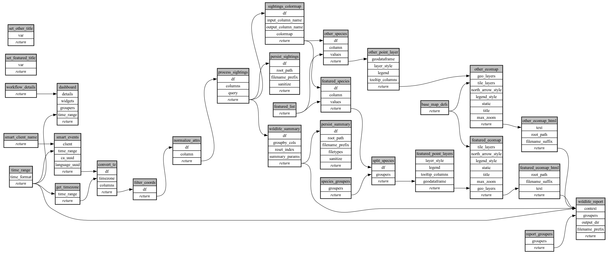

```
# AUTOGENERATED BY ECOSCOPE-WORKFLOWS; see fingerprint in README.md for details

```

```yaml
# fingerprint:
artifacts_sha256_basic: 6f53090aa3c61082ee05930069fe425b640cc8dc4640d2279790d27b56c9ad30
artifacts_sha256_strict: fa2f391188f9ad278e01a4dc7924547c656b6739eb5e8cf51c93ec1c86a77b63
installed_requirements:
- channel: file:///tmp/ecoscope-workflows/release/artifacts/
  name: ecoscope-workflows-core
  version: {version: ==0.22.14}
- channel: file:///tmp/ecoscope-workflows/release/artifacts/
  name: ecoscope-workflows-ext-ecoscope
  version: {version: ==0.22.17}
- channel: file:///tmp/ecoscope-workflows-custom/release/artifacts/
  name: ecoscope-workflows-ext-custom
  version: {version: ==0.0.37.dev13+g664ec55df}
- channel: https://repo.prefix.dev/ecoscope-workflows-custom/
  name: pydeck
  version: {version: ==0.9.1a2}
params_sha256: 8573b094602ceb22ca430a055208b0b46a074f1faf82b0e53077882182e80586
spec_sha256: f8d58d49cb7ec7c91e14c247bd730408b249daa16fd50964d6e4b20d4b0b3378

```

# ecoscope-workflows-mt-wildlife-workflow


